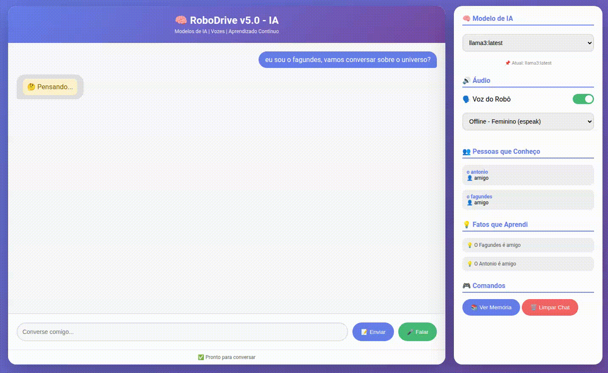

# RoboDrive Brain v5

Assistente pessoal de IA com memória persistente, síntese de voz e interface web. Projetado para rodar localmente usando Ollama como provedor de LLM.

<p align="center">
  
</p>

## Funcionalidades

- **IA conversacional** via Ollama (suporta Llama 3, DeepSeek, Qwen, etc.)
- **Memória persistente** em SQLite — lembra de conversas, pessoas e fatos aprendidos
- **Síntese de voz** com 10 vozes em português brasileiro (Edge TTS, Google TTS e offline com pyttsx3/espeak)
- **Duas interfaces**: CLI interativa (rich) e interface web (Flask)
- **Reconhecimento de voz** no navegador (Web Speech API) na interface web
- **Aprendizado automático** — extrai nomes e preferências das conversas
- **Troca dinâmica** de modelo LLM e voz em tempo de execução

## Requisitos

- Python 3.13+
- [Ollama](https://ollama.ai) rodando com pelo menos um modelo baixado

## Instalação

```bash
chmod +x setup.sh
./setup.sh
```

Ou manualmente:

```bash
python3 -m venv venv
source venv/bin/activate
pip install -r requirements.txt
mkdir -p data logs
cp .env.example .env  # edite conforme necessário
```

## Configuração

Edite o arquivo `.env`:

| Variável | Padrão | Descrição |
|---|---|---|
| `OLLAMA_HOST` | `http://localhost:11434` | Endereço do servidor Ollama |
| `MODEL_NAME` | `llama3:latest` | Modelo LLM padrão |
| `DEFAULT_VOICE` | `offline_feminino` | Voz TTS padrão |
| `TTS_RATE` | `0` | Velocidade da fala |
| `ENABLE_TTS` | `true` | Ligar/desligar TTS |
| `ROBOT_NAME` | `RoboDrive` | Nome do robô |
| `CREATOR_NAME` | `Tiago` | Nome do criador |
| `LOCATION` | `Casa do Tiago` | Localização do robô |
| `MEMORY_RETENTION_DAYS` | `30` | Retenção de memórias |
| `MAX_CONTEXT_MESSAGES` | `10` | Mensagens no contexto |

## Uso

### CLI

```bash
source venv/bin/activate
python cli.py
```

Comandos disponíveis no CLI:

| Comando | Descrição |
|---|---|
| `/ajuda` | Mostra ajuda |
| `/memoria` | Histórico da conversa |
| `/pessoas` | Pessoas conhecidas |
| `/fatos` | Fatos aprendidos |
| `/audio` | Liga/desliga TTS |
| `/voz <nome>` | Troca de voz |
| `/modelo <nome>` | Troca de modelo |
| `/sair` | Encerra |

### Web

```bash
source venv/bin/activate
python src/web_interface_v5.py
```

Acesse `http://localhost:5000`

## Vozes TTS Disponíveis

| ID | Provedor | Voz |
|---|---|---|
| `antonio` | Edge TTS | pt-BR-AntonioNeural |
| `francisca` | Edge TTS | pt-BR-FranciscaNeural |
| `thalita` | Edge TTS | pt-BR-ThalitaNeural |
| `brenda` | Edge TTS | pt-BR-BrendaNeural |
| `donato` | Edge TTS | pt-BR-DonatoNeural |
| `elza` | Edge TTS | pt-BR-ElzaNeural |
| `gtts_feminino` | Google TTS | pt |
| `gtts_masculino` | Google TTS | pt |
| `offline_feminino` | pyttsx3/espeak | Feminino |
| `offline_masculino` | pyttsx3/espeak | Masculino |

## Estrutura do Projeto

```
├── cli.py                    # Interface de linha de comando
├── src/
│   ├── audio/
│   │   └── tts_pro.py        # Motor de síntese de voz
│   ├── brain/
│   │   ├── llm_client.py     # Cliente para API do Ollama
│   │   └── memory.py         # Sistema de memória SQLite
│   ├── utils/
│   │   └── logger.py         # Configuração de logging
│   └── web_interface_v5.py   # Interface web Flask
├── data/
│   └── memories.db           # Banco de dados SQLite
├── .env                      # Variáveis de ambiente
├── requirements.txt          # Dependências Python
├── setup.sh                  # Script de instalação
└── README.md
```

## Tecnologias

- **Ollama** — execução local do LLM
- **SQLite** — armazenamento de memórias
- **Flask** — servidor web
- **Edge TTS / gTTS / pyttsx3** — síntese de voz
- **Rich** — interface CLI estilizada
- **Web Speech API** — reconhecimento de voz no navegador
